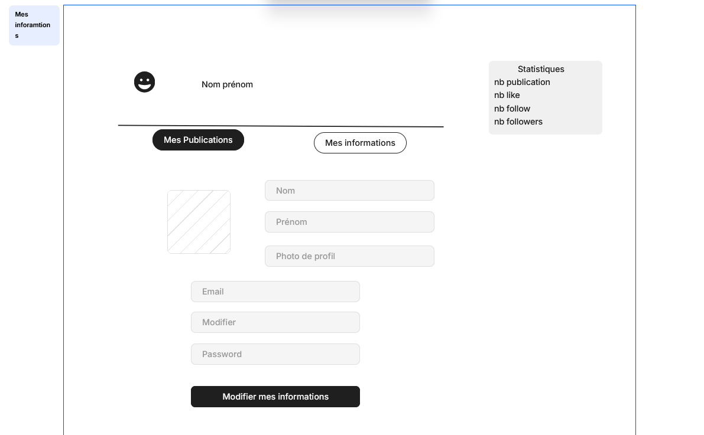

# Réseau Social

> *Enfin un réseau où tu n'es pas juste un pouce qui like 👍*

Un réseau social moderne qui met l'accent sur les interactions authentiques entre utilisateurs. Créez des publications, commentez, suivez vos amis et explorez du contenu — le tout dans une interface épurée et intuitive.

---

## 📸 Aperçu

| Page d'accueil | Fil d'actualité | Profil |
|:-:|:-:|:-:|
|  |  |  |

---

## Fonctionnalités

### Authentification
- Inscription avec nom, prénom, email et photo de profil
- Connexion / Déconnexion sécurisée
- Gestion de session via localStorage

### Publications
- Créer des posts avec texte et image optionnelle
- Fil d'actualité avec deux onglets : **Pour toi** et **Suivis**
- Supprimer ses propres publications

### Interactions sociales
- Système de likes
- Commentaires sur les publications
- Suivre / Ne plus suivre des utilisateurs

### Profil utilisateur
- Modifier ses informations personnelles
- Changer sa photo de profil
- Tableau de bord avec statistiques :
  - Nombre de publications
  - Likes reçus / donnés
  - Abonnés / Abonnements

### Recherche & Découverte
- Recherche de posts avec autocomplétion
- Recherche d'utilisateurs
- Suggestions en temps réel

---

## Stack Technique

| Technologie | Utilisation |
|-------------|-------------|
| **HTML5** | Structure des pages |
| **CSS3** | Design avec variables CSS et système de spacing |
| **JavaScript ES6+** | Logique applicative (vanilla, sans framework) |
| **localStorage** | Persistance des données côté client |

> Aucune dépendance externe — 100% vanilla.

---

## Design System

Le projet utilise un système de design cohérent basé sur des variables CSS :

```css
--color-primary: #6B1A2B;    /* Bordeaux profond */
--color-bg: #F7F7F8;         /* Fond gris clair */
--color-surface: #FFFFFF;    /* Cartes et surfaces */
--color-text: #111827;       /* Texte principal */
```

**Layout :** Grille 3 colonnes (sidebar gauche, feed central, sidebar droite) avec mise en page responsive en flexbox.

---

## Structure du Projet

```
Projet-IHM-main/
├── images/                    # Assets (logo, avatar par défaut)
├── images_plan_site/          # Maquettes et wireframes
└── pages/
    ├── html/                  # Pages HTML
    │   ├── page_accueil.html        # Landing page
    │   ├── file_d'actualite.html    # Fil d'actualité
    │   ├── header.html / footer.html
    │   └── profil/
    │       ├── connexion.html
    │       ├── creer_un_compte.html
    │       └── informations_profil/
    │           └── mon_profile.html
    ├── css/                   # Feuilles de style
    │   ├── reset.css / variables.css / components.css
    │   └── pages/             # Styles par page
    └── java/                  # Modules JavaScript
        ├── accountLogin.js / accountInscription.js
        ├── header.js
        ├── barre_de_recherche/    # Recherche posts & utilisateurs
        ├── publications/          # CRUD posts, likes, commentaires
        ├── page_profile/          # Profil & édition
        └── statistiques/          # Dashboard stats
```

---

## Installation & Lancement

### Prérequis
- Un navigateur moderne (Chrome, Firefox, Edge, Safari)
- Un serveur web local (recommandé)

### Lancer le projet

**Option 1 — Avec Python :**
```bash
cd Dev-app-IHM
python -m http.server 8000
```
Puis ouvrir : `http://localhost:8000/Projet-IHM-main/pages/html/page_accueil.html`

**Option 2 — Avec VS Code :**
Installer l'extension **Live Server**, clic droit sur `page_accueil.html` → *Open with Live Server*

**Option 3 — Ouvrir directement :**
Double-cliquer sur `Projet-IHM-main/pages/html/page_accueil.html`

---

## Parcours Utilisateur

```
Page d'accueil → Inscription / Connexion → Fil d'actualité
                                                  │
                          ┌───────────────────────┼───────────────────────┐
                          │                       │                       │
                    Créer un post          Rechercher des          Voir son profil
                    Liker / Commenter      utilisateurs            Modifier ses infos
                                           Les suivre              Voir ses stats
```

---

## Stockage des Données

Les données sont persistées dans le `localStorage` du navigateur :

| Clé | Contenu |
|-----|---------|
| `account` | Liste de tous les comptes utilisateurs |
| `connectedAccount` | Session de l'utilisateur connecté |
| `post` | Toutes les publications |
| `comptes_suivis` | Relations de suivi entre utilisateurs |

> Les données sont perdues si le cache du navigateur est vidé.

---

## Équipe

Projet réalisé dans le cadre d'un cours d'**IHM** (Interaction Homme-Machine).

Pascolo Léandre
Cartier Alexandre
---

## Licence

Projet académique — Tous droits réservés.
